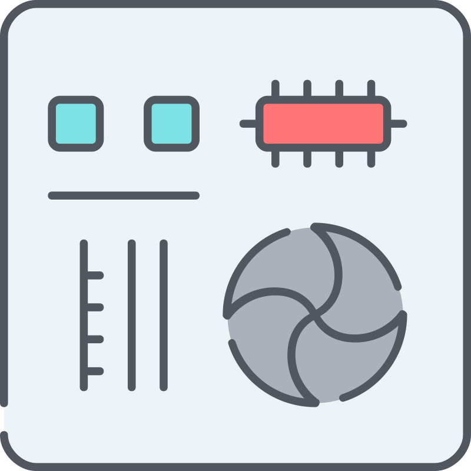

<!-- Hi, I am Jany Muong 👋🏿 -->
<!-- about me -->

<h2 align="center"><code>Hello, World</code> 👋🏿:</h2>

I am [Jany Muong](https://www.github.com/janymuong/)

I do Software Engineering, Machine Learning, Cloud DevOps, Computer Science,  and other things :) 

---
# &nbsp;About ME:

### Full-stack and Cloud DevOps Engineering

I use mainly `Python` and `Flask`, `Postgres`, `JavaScript` and `React`, and `Amazon Web Services - AWS`.

🌱 Currently working on:  
**Web Development**, **Cloud DevOps Engineering** and **AI - Machine Learning**.      
Also, I am looking to collaborate with other developers on **open-source**, and I'm excited about this!

>⚡fun fact: I love to play video games, I am a massive anime nerd, and I like jokes :)

&nbsp;
## My Tech Stack:

This covers languages, frameworks, cloud compute, databases & ORM, SaaS clients, etc, that I work with.

   
  <code></code>
  
  
  
  
  
  
  <a href="https://www.w3schools.com/css/" target="_blank"> 
   
  
  <!--  -->
  
  
  
  
  
  
  
  
  
  <!--  -->
  
  
  
  

<!--   -->

## Tool Setup ⚙️:
This segment lists out editors and tools/command-line utilities that I use.

 
  
  
  
  <code></code>
  
  
  
  
  
  <!--  -->

  

  
also, I use: 

  
  <!--  -->

<!-- 
### :card_file_box: DATABASES

 

 

  

<!--    -->

---
### CONNECT with ME :

 

 
 

<code></code>

[twitter]: https://twitter.com/janymuong